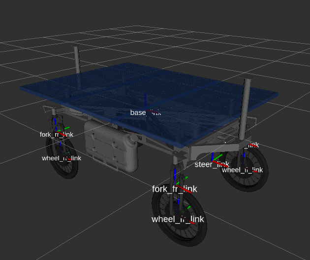

# weed_robot_description

Descripción del robot desmalezador usando xacro.
El archivo de configuración [config/weed_robot.yaml](config/weed_robot.yaml) especifica las dimensiones y masa de cada parte del robot. Con dicha información de calcula la matriz de momento de inercia para cada parte.
En el directorio [meshes](meshes) se encuentras las mallas 3D en formato STL.

Para visualizar el modelo del robot con rviz usar [launch/rviz.launch](launch/rviz.launch) con los siguientes argumentos:
* meshes
  * true: genera URDF usando las mallas STL para el modelo visual y figuras geométricas simples para el modelo de colisión.
  * false: genera el modelo URDF usando formas geométricas simples tanto para el modelo visual como para el de colisión (útil para verificar el modelo de colisión).
* config: este parámetro indica el archivo de configuración para rviz (por defecto usa normal, pero se puede configurar bottom y top para otros puntos de vista)